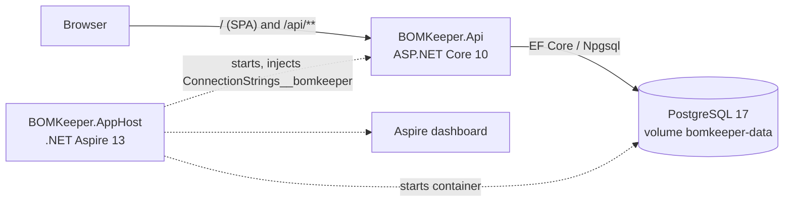
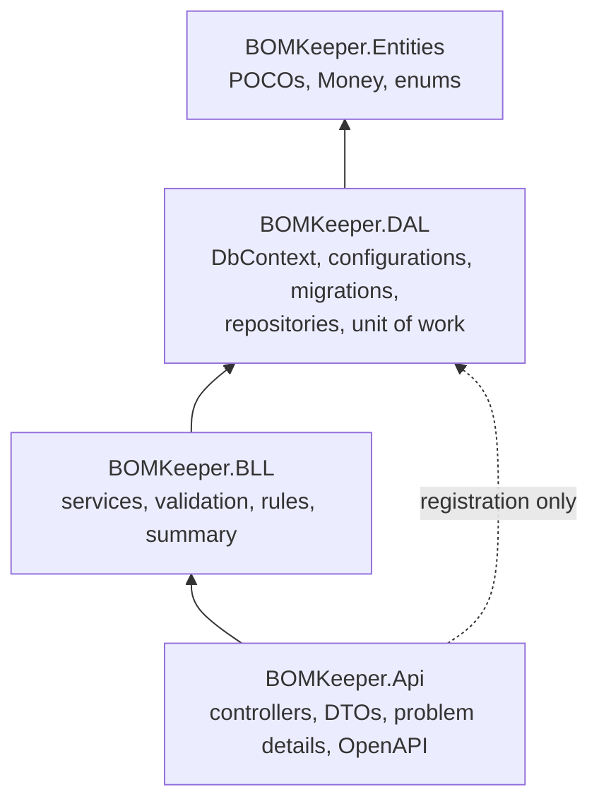
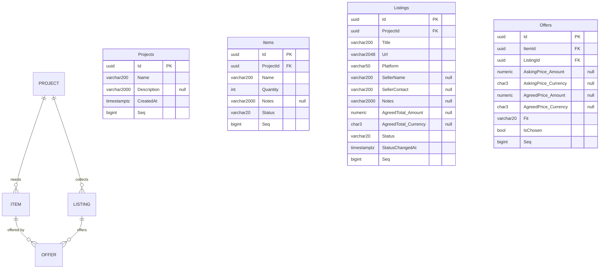

# BOMKeeper architecture

This page describes how the system is put together. *What* it does is specified in
[`openspec/specs/`](../openspec/specs/), and *why* it is built this way is recorded in
[`docs/adr/`](adr/). The detailed design of MVP-1 (decisions D1–D7, cited in code comments as
"design Dn") is in the archived change:
[`design.md`](../openspec/changes/archive/2026-10-01-add-mvp1-core-tracking/design.md). This page
repeats what a rebuild needs from it.

| Decision | In short |
|---|---|
| D1 Walking skeleton | the solution, Aspire, the first migration, health and SPA hosting, and a Playwright smoke test came before any feature |
| D2 Persistence | repositories + unit of work in the DAL, code-first migrations, a hidden `Seq` column for ordering (see [Data model](#data-model)) |
| D3 BLL and errors | hand-written validation with field errors by JSON path, exceptions mapped to problem details (see [Error model](#error-model)) |
| D4 HTTP API | thin controllers, DTOs in the Api, strict JSON (see [API](#api)) |
| D5 Contract drift | a normalized structural comparison of the generated document with the contract (see [Contract drift](#contract-drift)) |
| D6 Frontend | generated types, one service per resource, signals, no store (see [Frontend](#frontend)) |
| D7 Traceability | test names repeat scenario titles (`DisplayName` in xUnit), see [Tests](#tests) |

## Runtime

- One URL serves both the UI and the API (http://localhost:5272, pinned in the Api's
  `Properties/launchSettings.json`; the Angular dev proxy and Playwright assume it). The Angular build is copied into the
  Api's `wwwroot`. Unknown `/api/**` routes return 404 problem details; any other path falls back to
  `index.html` (ADR 0005).
- The AppHost only launches things: the Postgres container (image tag `17`, with a persistent volume) and
  the Api, with `WaitFor(db)`. It contains no business code.
- In Development the Api applies EF migrations on startup and exposes `/openapi/v1.json`, `/api/health`
  and `/api/alive`. The Aspire ServiceDefaults template maps `/health` and `/alive`; they were moved
  under `/api/` so that the SPA fallback never swallows them.

## Backend layers

- **Reference direction** (ADR 0004): Entities ← DAL ← BLL ← Api. The Api touches the DAL only through
  `AddBomKeeperDatabase()` and `MigrateBomKeeperDatabaseAsync()` in `Program.cs`. Architecture tests in
  `BOMKeeper.BLL.Tests` enforce this from the project files and sources.
- **DAL.** `BomKeeperDbContext`, one `IEntityTypeConfiguration` per entity, and the repositories
  `IProjectRepository` (`FindAsync`, `ExistsAsync`, `ListWithCountsAsync`), `IItemRepository` and
  `IListingRepository` (`FindAsync`, `ListByProjectAsync`), and `IOfferRepository` (`FindAsync`,
  `ExistsAsync(itemId, listingId)`, `ListByItemAsync`, `ListByListingAsync`, `FindChosenForItemAsync`,
  `ListChosenByProjectAsync`), plus add/remove. `IUnitOfWork` has `SaveChangesAsync` and
  `ExecuteInTransactionAsync(work)`. A unique-index violation surfaces as the DAL's
  `UniqueConstraintViolationException`, never as a raw Npgsql error.
- **Controllers are thin.** The DTOs (records in `BOMKeeper.Api/Contracts`) are mapped by hand (no
  AutoMapper), and each controller calls one BLL service. The BLL takes and returns its own input and
  result types, never DTOs. Route names equal the contract's `operationId`s.
- **BLL** (one service per capability, plus `SummaryService`):
  - validation is plain code, with field errors keyed by JSON path (`askingPrice.amount`). All field
    errors of a request are collected and reported together;
  - texts are trimmed. A required text must be 1–max characters after trimming. An optional text keeps
    `null` as `null`;
  - the order of checks: the ids exist, first the path id and then the ids referenced in the body
    (404; an unknown `listingId` when creating an offer is a 404 too, by the human's decision of
    2026-09-30), then field validation (400), then the business rules (409);
  - the rules: an item and its listing are in the same project, no duplicate links, and statuses are
    changed manually (any transition is allowed);
  - money: 0–999999999.99 with at most 2 decimals, and a currency from the in-code list
    `BLL/Validation/CurrencyCodes.cs`. This is ISO 4217 List One as of 2025-07-01 (XCG instead of ANG, ZWG
    instead of ZWL), without the codes nobody prices in (human decision, 2026-09-30): XXX, XTS,
    XAU/XAG/XPT/XPD, XBA–XBD, XDR, XSU, XUA and the fund codes BOV, CHE, CHW, CLF, COU, MXV, USN, UYI,
    UYW. The list is in code, so validation doesn't depend on ICU or culture data;
  - choosing an already chosen offer, and un-choosing one that isn't chosen, both succeed and change
    nothing (idempotent);
  - errors are exceptions (`ValidationFailedException`, `NotFoundException`, `BusinessRuleException(code)`).
- **Transactions.** Choosing an offer switches the item's choice as ordered writes (clear, then set) in
  one transaction, which a partial unique index backs. The Aspire Npgsql integration enables EF's
  retrying execution strategy (default settings). `ExecuteInTransactionAsync` runs the work inside
  `CreateExecutionStrategy().ExecuteAsync` and clears the change tracker before each attempt, so a retry
  starts from fresh state and can never report a choice that wasn't saved. A unique-index race on a
  duplicate link is translated into the `duplicate-offer` 409.

### Error model

One `BllExceptionHandler` maps the BLL exceptions to RFC 9457 problem details
(`application/problem+json`):

| Cause | Status | Body |
|---|---|---|
| `ValidationFailedException` | 400 | `ValidationProblemDetails`, `errors` keyed by JSON path |
| Malformed JSON, a wrong JSON type, a number in a string, an unknown enum name or an enum as a number | 400 | the same shape, from the `[ApiController]` model-state response (`ProblemDetailsResult.ForInvalidModelState`), with ASP.NET's default keys |
| `NotFoundException`, or an unknown `/api/**` route | 404 | problem details |
| `BusinessRuleException(code)` | 409 | `type: /problems/<code>` (`duplicate-offer`, `listing-in-other-project`), plus `title` and `status` |

JSON is camelCase. Enums are written by name only (`JsonStringEnumConverter` with
`allowIntegerValues: false`), and numbers must be JSON numbers (`JsonNumberHandling.Strict`). Request
bodies are accepted as `application/json` only. See `Api/Contracts/ApiJson.cs`.

`POST /api/items/{itemId}/offers` returns `201` with `Location: /api/offers/{offerId}`. That URL
has PUT and DELETE but no GET, because offers are always read through their item or listing (human
decision, 2026-09-30).

## Data model

- **Naming:** EF Core defaults. Tables are plural PascalCase, columns are the property names, and a
  `Money` complex property becomes `<Property>_Amount numeric(12,2)` + `<Property>_Currency char(3)`.
  Both columns are null when there's no price. Enums are stored as their names (`varchar(20)`).
- The ids are UUID v7, generated by the BLL (`Guid.CreateVersion7()`). Ordering uses the hidden identity
  column `Seq` (`GENERATED ALWAYS`), because UUID v7 is only ordered to the millisecond. Projects are
  listed newest first; items, listings and offers in insertion order.
- Money is never converted between currencies (ADR 0002). Summary totals are Σ (agreed ?? asking) ×
  quantity over the chosen offers, one total per currency, sorted by currency code. A project with
  mixed currencies simply has several totals. The summary's "items without a chosen offer" and "chosen
  offers without a price" lists keep item order.
- **Deletes cascade** in the database: Project → Items and Listings; Item → its Offers; Listing → its Offers.
- **Indexes:** unique `IX_Offers_ItemId_ListingId` (no duplicate links), and partial unique
  `IX_Offers_ItemId_Chosen` on `ItemId` WHERE `"IsChosen"` (at most one chosen offer per item).
- The schema is code-first; the migrations are in `backend/src/BOMKeeper.DAL/Migrations`.

## API

The contract is [`openspec/contracts/openapi.yaml`](../openspec/contracts/openapi.yaml) (OpenAPI 3.1,
26 operations), and it is the source of truth for both sides (ADR 0007, ADR 0010):

| Area | Routes |
|---|---|
| Projects | `GET/POST /api/projects`, `GET/PUT/DELETE /api/projects/{projectId}`, `GET …/summary` |
| Items | `GET/POST /api/projects/{projectId}/items`, `GET/PUT/DELETE /api/items/{itemId}`, `PATCH …/status` |
| Listings | `GET/POST /api/projects/{projectId}/listings`, `GET/PUT/DELETE /api/listings/{listingId}`, `PATCH …/status` |
| Offers | `GET/POST /api/items/{itemId}/offers`, `GET /api/listings/{listingId}/offers`, `PUT/DELETE /api/offers/{offerId}`, `PATCH …/fit`, `PATCH …/choice` |

- **Backend:** a contract-drift integration test compares a normalized `/openapi/v1.json` with the
  contract (see below).
- **Frontend:** the types are generated with `openapi-typescript` (`npm --prefix frontend run generate:api`),
  and the gate fails if the generated file is stale.

### Contract drift

`ContractDriftTests` (in `Api.IntegrationTests/Contract`) reduce both documents to a sorted map of
"path → value" entries (`ContractNormalizer`) and list every difference. A difference is fixed in the
code, or escalated as a contract change, but never fixed by loosening the comparer.

- **Kept:** every operation under `/api/` except `/api/health`: the `operationId`, the path parameters,
  the request body (whether it's required, its media types and schema), and the response status codes,
  media types, schemas and header names. Also every schema reachable from them: the JSON type, nullability
  as a boolean (however it's spelled: `type: [x, "null"]`, a `oneOf`/`anyOf` with null, or
  `nullable: true`), properties, `required`, `enum`, `minimum`/`maximum`, `minLength`/`maxLength`,
  `pattern`, `items` and `additionalProperties`. Numbers compare by value.
- **Dropped:** `info`, `servers`, `security`, `tags`, summaries, descriptions, examples, `format`,
  `multipleOf`, `x-*`, the order of keys and array elements, and the bodies of 204 responses.

`Api/OpenApi/ContractTransformers.cs` fills in only what the generator can't derive from the code:
1. a `Location` header on every `201`;
2. string enums for the enum schemas (the converter writes names);
3. a `MoneyTotal.amount` with a lower bound only (a total may exceed the single-price limit).

## Frontend

- Angular 22 (standalone, zoneless, signals) and Angular Material 3. The routes are lazy-loaded:
  `/projects`, `/projects/:projectId` (Items and Listings tabs, plus the summary), `/items/:itemId`, and
  `/listings/:listingId`.
- One typed `HttpClient` service per resource (`src/app/api`), with a problem-details mapper: a `400`
  becomes field errors and a `409` becomes its rule code.
- Pages keep their state in signals through a shared `Loader`, which reloads on route-id changes and
  cancels superseded requests. Mutations reload the affected data, and there is no global store.
- `/` and unknown paths redirect to `/projects`.
- **Screens:**
  - the project list (cards with item and listing counts; New, Edit, Delete);
  - the project detail: a header, the summary card (counts by status, totals per currency, items without
    a chosen offer), and the Items tab (status chip, quantity, chosen offer) and Listings tab (status,
    platform host, seller, agreed total);
  - the item detail: its offers with fit, prices and choice; Add offer links one of the project's listings;
  - the listing detail: its status select, and its offers across items.
- **Dialogs:** new/edit project, add/edit item, add/edit listing, add offer, edit prices. They share one
  `.dialog-form` layout: a single column, with only amount + currency on one row, and a 560 px width. The
  currency is a 3-letter text input that is trimmed and upper-cased (`shared/money.ts`), and the server
  validates it against the list. Field errors from a `400` appear under their fields
  (`applyServerErrors` in `shared/form-errors.ts`). Any other error is shown as one alert line with the
  problem's `title`: in the dialog for a save, on the page for a row action. For a `409` that title is
  the generic "Business rule violated" (a candidate improvement: show `detail`). The add-offer dialog
  lists only the project's listings, so `listing-in-other-project` can't come from the UI.
- **Labels:** enum names are shown as words (`NotResponding` → "Not responding", `WrongItem` → "Wrong
  item"; `humanLabel` in `shared/display.ts`). The specs use the API names.
- **Chip tones** (`styles.scss`, Material 3 system colours):

  | Tone | Item status | Listing status | Fit |
  |---|---|---|---|
  | neutral (the base chip, grey fill) | | Found | Unverified |
  | muted (outline only) | Needed | NotResponding, Declined | |
  | tertiary | Sourcing | Contacted, Negotiating | NotQuiteRight |
  | secondary | Ordered (solid) | Agreed, Purchased | |
  | primary | Received (solid) | Received | Fits |
  | error, bold | | Scam | WrongItem |

- Below 600 px, tables turn into stacked label/value rows.

## Tests

| Level | Where | Runs in |
|---|---|---|
| BLL unit (xUnit, hand-written fakes) | `backend/tests/BOMKeeper.BLL.Tests` | `npm run check:be` |
| Architecture (reference direction) | same | same |
| API integration (WebApplicationFactory + Testcontainers `postgres:17`, reset between tests), plus the drift test | `backend/tests/BOMKeeper.Api.IntegrationTests` | `npm run check:be` (Docker) |
| Frontend unit (Vitest, TestBed, HttpTestingController) | `frontend/src/**/*.spec.ts` | `npm run check:fe` |
| E2E (Playwright, against the stack started by the AppHost) | `frontend/e2e/*.spec.ts` | `npm run e2e` |
| Visual (screenshots at 390, 1280 and 2048 px) | `frontend/e2e/screens/` | `npm run screens` |

Test names repeat the spec scenario titles (`"offers: Choosing switches the choice"`), so a scenario can
be traced to its test with a grep.

## Harness (how agents work on it)

- **Rules:** [AGENTS.md](../AGENTS.md) is canonical for Claude Code, Codex and Antigravity. The role
  prompts are in `.agents/roles/`, and the vendored skills in `.agents/skills/` (pinned in
  `skills-lock.json`).
- **Gate:** `scripts/check.mjs`, used by `npm run check`, the pre-commit hook and the agent Stop hooks:
  - red runs are validated (they must fail on assertions; compile, infrastructure and selector errors are
    rejected);
  - every ticked `[checks]` task needs red evidence;
  - every review needs a Resolution.
- **Reviews:** `scripts/review.mjs` runs a Codex checker (another vendor's model, read-only) and writes
  the report and the ledger row.
- **Hooks:** `protect-env` (no access to `.env*`), the action log, and the maker SubagentStop loop
  (`check --fast` on the maker's own side, at most 3 re-entries, then a logged retry stop).
- **Run control:** `npm run start` and `npm run stop`. The stop script also removes Aspire's detached
  `dcp` processes.

### Red-run classification

`check --red <task>` runs the scoped tests and passes the exit code and output (ANSI colours stripped) to
`classifyRedRun` in `scripts/lib/red.mjs`. The evidence file is written only when the run is accepted.
The rules apply in this order, and the first match wins:

1. exit code 0 → rejected (a red run must fail);
2. a compile error (`error CS…`, `error TS…`) → rejected (add stubs so the tests compile);
3. a test error, i.e. a Playwright strict-mode violation or an invalid selector → rejected (fix the test);
4. no tests ran → rejected (check the filter);
5. an infrastructure failure (a missing command or script, a NuGet error, Docker down, a fixture that
   threw, a Playwright browser or connection error) → rejected;
6. no failing-test summary line from dotnet, Vitest, node:test or Playwright → rejected;
7. no assertion or stub signature (xUnit `Assert.*() Failure`, `AssertionError`, `expected … to`,
   Playwright `Error: expect(`, HttpTestingController's "Expected one matching request",
   `NotImplementedException`) → rejected;
8. otherwise accepted: "Tests ran and failed on assertions."

`scripts/test/red.test.mjs` pins each rule with real runner output. `npm run check` then requires an
evidence file for every ticked `[checks]` task, in active and archived changes alike.
